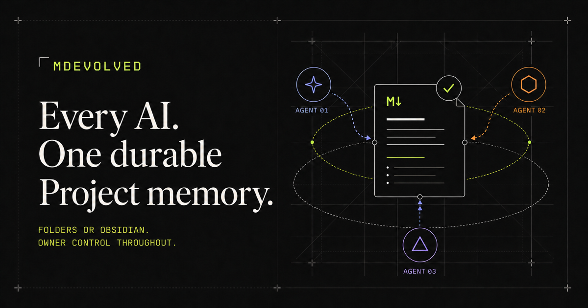

# MDevolved

<p align="center">
  
</p>

<p align="center">
  <strong>Your AI should not forget your project when the session ends.</strong><br />
  MDevolved gives every compatible AI the same durable, cited Project memory—<br />
  so work can resume across sessions, tools, orchestrations, and computers.
</p>

<p align="center">
  <a href="https://deploy.workers.cloudflare.com/?url=https://github.com/msinclair25/mdevolved"><strong>Deploy MDevolved Community</strong></a>
  ·
  <a href="#the-lovable-moment">See the lovable moment</a>
  ·
  <a href="docs/AGENT-FIRST-QUICKSTART.md">Quick start</a>
  ·
  <a href="https://mdevolved.com/#alpha-access">Request managed alpha</a>
</p>

<p align="center">
  <a href="https://github.com/msinclair25/mdevolved/actions/workflows/ci.yml"></a>
  <a href="LICENSE"></a>
  <a href="https://www.npmjs.com/package/mdevolved"></a>
  
</p>

---

AI coding tools are excellent at doing the work in front of them. They are bad
at inheriting the work that happened somewhere else.

The plan is in Claude. The useful failure is in Codex. The decision is buried
in a chat that expires. The next agent starts over, repeats the same mistakes,
and asks the human to reconstruct the project again.

**MDevolved makes the project—not the session—the durable unit of work.**

It keeps the objective, current state, decisions, cited evidence, useful
failures, preferences, attached skills, and exact next action ready for whichever
authorized agent works next.

| Without MDevolved                           | With MDevolved                                   |
| ------------------------------------------- | ------------------------------------------------ |
| Re-explain the project in every new session | Resume the exact durable Project                 |
| Copy conclusions without their sources      | Carry cited evidence and attributable handoffs   |
| Lose useful failures and repeat dead ends   | Leave a verified checkpoint for the next agent   |
| Lock context inside one provider            | Move between compatible tools and computers      |
| Give an agent everything or nothing         | Grant one exact Source and folder boundary       |
| Mistake sync for recovery                   | Keep encrypted, independently restorable backups |

## The lovable moment

You work on a project in Codex today. Tomorrow you open Claude—or a fresh
Codex task on another computer—and say:

> **MDevolved resume project**

The agent receives the current objective, accepted decisions, relevant cited
evidence, known failures, working preferences, and the next action. It does not
need the old chat. You do not rebuild the prompt.

When the agent finishes, it leaves a compact verified checkpoint. The next
session starts further ahead.

That same loop works when an orchestration manages several agents: the harness
still schedules and supervises them, while MDevolved keeps the shared Project
truth, bounded context, evidence, review, exceptions, and continuity.

**Fewer resets. Better handoffs. Work that compounds.**

## Use the agents you already like

MDevolved is not another model, IDE, or orchestration runtime. Codex, Claude,
Cursor, Hermes, Orca, and other compatible tools keep their own models, shells,
sandboxes, worktrees, retries, and subscriptions.

MDevolved sits underneath them as the durable Project layer:

```text
Markdown folder or Obsidian
            ↓
   owner-controlled Project
            ↓
memory · evidence · decisions · skills · next action
            ↓
one agent · another agent · an orchestration · another computer
```

Clients connect in the simplest shape they support:

- **Direct MCP** for compatible desktop, IDE, and terminal agents.
- **Lead-mediated MCP** when an orchestration keeps one authorized connection
  and manages its own workers.
- **Portable Markdown/JSON handoff** when live remote MCP is unavailable.

No provider becomes a required dependency. See the
[compatibility guide](docs/MCP-COMPATIBILITY.md) for the current protocol and
dated client evidence.

## How it works

1. **Connect one Source.** Connect the Markdown folder or Obsidian workspace you choose.
2. **Connect an agent.** Choose the agent, Project name, Source, and exact
   folders it may read. Revoke access at any time.
3. **Say _Connect this project to MDevolved_.** The agent creates, joins, or
   resumes the Project without a copied prompt or manual Project ID.
4. **Keep working normally.** The agent retrieves targeted evidence when
   needed and checkpoints verified progress before it finishes.

The ordinary agent loop is intentionally small:

```text
resume → find what matters → do the work → checkpoint → continue
```

MDevolved handles routine context renewal and continuity. The owner returns
only when work requests more authority, a destructive action, protected paths,
more budget, or a decision between conflicting evidence.

## Memory that earns its place

MDevolved does not scrape chats or turn every agent sentence into permanent
memory.

- **Evidence stays attached.** Durable claims retain their sources and
  provenance.
- **Suggestions are reviewable.** Repeated preferences and successful methods
  can become proposed memory; they are not silently promoted.
- **Skills stay portable and inert.** A compatible harness may load them, but a
  skill cannot expand its own authority.
- **Different roles get different context.** Focused agents can continue prior
  work, independent agents can avoid peer conclusions, and synthesis agents can
  compare attributable results.
- **Useful failures survive.** A failed verification keeps the same work active
  instead of pretending the project advanced.

MDevolved derives one next action from that durable state, so the next agent
starts with a useful move instead of another archaeology session.

## Autonomy without another supervisor

Run one agent or an entire orchestration. MDevolved automates the routine coordination.
It does not compete with the harness.

- A solo agent can complete bounded work under an owner-consented verification
  policy.
- A lead-managed run can delegate to several claimed actors and route an
  independent review.
- Routine allowed work continues without repeated MDevolved-specific owner
  actions.
- Authority expansion, destructive requests, protected paths, exhausted
  budgets, and conflicting evidence become explicit exceptions.
- Revocation is authoritative and immediate.

MDevolved records bounded results and evidence. It never claims to execute the
agent's tests, ingest hidden reasoning, or control the agent runtime.

## Own the memory

The complete Apache-2.0 Community source is public and deploys into your own
Cloudflare account.

- **Your files stay yours.** Pair only the Sources you choose.
- **Passkey-protected owner control.** Every agent receives a distinct,
  revocable authorization.
- **No raw transcript ingestion.** MDevolved stores durable contributions, not
  provider conversations or chain-of-thought.
- **Encrypted recovery.** Snapshots are owner-key-controlled and independently
  restorable.
- **Recovery restores knowledge, not power.** Grants, credentials, sessions,
  actors, leases, and OAuth state never come back from a backup.
- **No managed-service lock-in.** Community remains independently deployable.

Read the full [security model](docs/SECURITY-MODEL.md) and
[backup and recovery model](docs/BACKUP-RECOVERY.md).

## Start with a folder

The fastest generic Source path is one command:

```bash
npx mdevolved@latest sync .
```

Prefer Obsidian? Use the optional
[MDevolved Sync for Obsidian](packages/obsidian-plugin/README.md) adapter
instead. Both use the same source-neutral sync and durable Project model;
Obsidian is an optional richer adapter, not a requirement. The canonical MD9
plugin identity is `mdevolved-sync`; the previously published `owd-sync`
adapter remains available as a clearly labelled compatibility path while the
new release is prepared.

### Deploy Community

[](https://deploy.workers.cloudflare.com/?url=https://github.com/msinclair25/mdevolved)

The deployment runs in your Cloudflare account. MDevolved never receives your
Cloudflare credentials or recovery private key.

Then follow the [agent-first quick start](docs/AGENT-FIRST-QUICKSTART.md):

1. claim the deployment with a passkey;
2. connect one disposable Source;
3. connect one compatible agent;
4. say **Connect this project to MDevolved**; and
5. resume the Project from a fresh session.

## Public alpha

MDevolved is ready for technical alpha testing, not yet for unattended use with
irreplaceable data.

- Start with synthetic or disposable Sources.
- One owner per deployment; team accounts are not available yet.
- The managed service remains invitation-only.
- Web editing currently covers Markdown text and note creation—not rename,
  deletion, attachments, or arbitrary `.obsidian` writes.
- MDevolved Sync for Obsidian is not yet listed in Obsidian Community Plugins.
- Protocol compatibility does not imply that every client release has completed
  a dated live acceptance exercise.

See the [current alpha status](docs/ALPHA-STATUS.md) and
[public roadmap](docs/ROADMAP.md).

## Learn more

- [Why MDevolved exists](docs/PRODUCT.md)
- [Agent-first quick start](docs/AGENT-FIRST-QUICKSTART.md)
- [Agent access and MCP](docs/AGENT-ACCESS.md)
- [Architecture](docs/ARCHITECTURE.md)
- [Security model](docs/SECURITY-MODEL.md)
- [Complete documentation index](docs/README.md)

<details>
<summary><strong>Legacy compatibility</strong></summary>

MDevolved was formerly called **OWD**. New installs, package imports, MCP
operations, pairing links, portable formats, and the Obsidian adapter use the
MDevolved identity. Existing deployments, stored records, bookmarks, old MCP
operations, `owd-pair` links, exports, backups, and the `owd-sync` plugin
identity remain readable through a compatibility adapter. The private former
workspace package scope remains only in repository history and explicit
compatibility fixtures; it was never a public package contract.
Those technical names stay visible only where an existing client or stored
record requires them; no rename or restore operation copies grants, sessions,
credentials, or other live authority.
The technical compatibility protocol retains the OWD name where changing it
would break an existing client or durable record.

</details>

<details>
<summary><strong>Development</strong></summary>

```sh
pnpm install
pnpm check
pnpm test
pnpm test:e2e
pnpm build
pnpm deploy:dry-run
```

See the [development contract](docs/DEVELOPMENT.md) and
[public quality gates](docs/QUALITY-GATES.md).

</details>

## License

MDevolved is licensed under the [Apache License 2.0](LICENSE). Vendored
upstream components retain their original notices and licenses.
