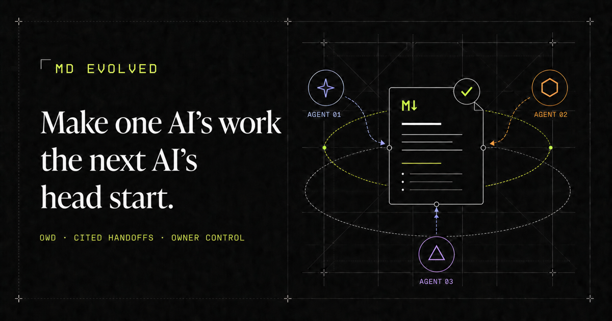
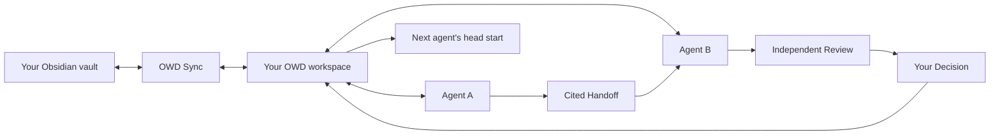

# OWD Platform

<p align="center">
  
</p>

<p align="center">
  <strong>Make one AI's work the next AI's head start.</strong><br />
  The owner-controlled continuity layer for Obsidian and independent AI agents.
</p>

<p align="center">
  <a href="https://deploy.workers.cloudflare.com/?url=https://github.com/msinclair25/owd-platform"><strong>Deploy Community</strong></a>
  ·
  <a href="#how-owd-works">See how it works</a>
  ·
  <a href="https://mdevolved.com/#alpha-access">Request managed alpha</a>
  ·
  <a href="docs/SECURITY-MODEL.md">Trust model</a>
  ·
  <a href="https://github.com/msinclair25/owd-sync">OWD Sync</a>
</p>

<p align="center">
  <a href="https://github.com/msinclair25/owd-platform/actions/workflows/ci.yml"></a>
  <a href="LICENSE"></a>
  <a href="https://github.com/msinclair25/owd-sync/releases/tag/owd-sync-v0.1.6"></a>
  <a href="docs/OBSIDIAN-MIND-COMPATIBILITY.md"></a>
  <a href="docs/EVE-COMPATIBILITY.md"></a>
  <a href="docs/ALBATROSS-COMPATIBILITY.md"></a>
  
  
</p>

OWD keeps the AI tools you already use independent, then carries the work you
choose to share forward with its sources and your Decisions attached. It turns
an Obsidian vault into bounded, cited Project context without becoming another
model subscription, scraping hidden conversations, or silently deciding what
is true.

> [!IMPORTANT]
> **This is an alpha release.**
> The complete Apache-2.0 Community source is public and independently
> self-hostable. Start with synthetic or disposable vaults while evaluating a
> deployment. The optional managed service remains invitation-only and uses
> one isolated data-plane cell per owner.

## The problem OWD solves

Every capable AI starts strong and then forgets the work trapped in another
tool. Copying chats forward loses sources, mixes claims with decisions, and
makes access nearly impossible to audit.

| Without OWD                                      | With OWD                                                          |
| ------------------------------------------------ | ----------------------------------------------------------------- |
| Re-explain the Project in every new session      | Resume one durable, versioned Project record                      |
| Copy conclusions without knowing their sources   | Carry cited Artifacts, Handoffs, and Reviews                      |
| Let an agent's output quietly become “the truth” | Keep agent contributions separate from owner Decisions            |
| Hand over a whole vault or paste notes manually  | Grant one exact vault and optional folder boundary                |
| Treat sync as if it were a backup                | Keep encrypted, independently restorable recovery points          |
| Lock useful context inside one provider          | Use standard MCP plus portable Markdown and JSON fallback formats |

## How OWD works



1. **Pair the vault you choose.** OWD Sync connects only the open, explicitly
   approved Obsidian vault.
2. **Publish current context.** OWD automatically builds a searchable library
   from the latest durable sync state.
3. **Connect independent agents.** Each compatible client receives its own
   revocable, read-only vault and folder grant through remote MCP.
4. **Prepare one Project handoff.** Choose the agent, Project name, vault, and
   folder once during guided onboarding.
5. **Say _Connect this project to OWD_.** The working agent creates, joins,
   rejoins, or resumes the exact Project on the same connection.
6. **Carry only the work you approve.** Share cited contributions, request an
   independent Review, and record the owner Decision that should survive.

No prompt is copied back into the agent. The prepared first Project requires no
second MCP authorization and no daily packet renewal. A changed boundary or a
later unmatched Project still returns to one exact owner consent.

> [!TIP]
> **A new agent session continues the same Project.** OWD-compatible agents
> should read `.owdignore` and call `resume_project` automatically before using
> prior Project context or reporting their writer role. If a client misses that
> startup step after a crash or reset, say **OWD resume project**. OWD restores
> the exact Project and durable writer role without reconnecting MCP or asking
> for new approval.

## Why it is different

| One owner-controlled record                                                                              | Agents stay agents                                                                                                |
| -------------------------------------------------------------------------------------------------------- | ----------------------------------------------------------------------------------------------------------------- |
| Projects, Work Packets, Artifacts, Handoffs, Reviews, Decisions, and provenance survive the session.     | Codex, Claude, Grok, Eve.dev, Obsidian Mind, Hermes, and other clients keep their native tools and subscriptions. |
| **Evidence before memory**                                                                               | **Consent before access**                                                                                         |
| Sources remain attached. Shared work is visible without becoming accepted truth until the owner decides. | Every grant names the exact client, vault, folders, scopes, and restored sources—and can be revoked.              |
| **Portable by design**                                                                                   | **Recovery separate from sync**                                                                                   |
| Canonical notes remain Markdown; collaboration exports use documented, provider-neutral records.         | Encrypted snapshots remain independently inspectable, downloadable, and restorable.                               |

## One workspace, clear responsibilities

| Surface          | What it owns                                                                                      |
| ---------------- | ------------------------------------------------------------------------------------------------- |
| **Obsidian**     | The owner's readable Markdown workspace                                                           |
| **OWD Sync**     | The sync boundary for only the explicitly paired vault                                            |
| **OWD Platform** | Passkeys, libraries, grants, Projects, provenance, Decisions, and encrypted recovery              |
| **AI clients**   | The work itself, using their own models, tools, sandboxes, and subscriptions through standard MCP |

OWD Sync does not authorize agents or create Projects. An MCP grant does not
grant local Obsidian CLI, shell, or filesystem authority. The human always
remains the vault owner.

## Built around the owner's workflow

The authenticated workspace is a focused folder-style application:

- **How OWD works** — guided onboarding first; advanced controls afterward
- **Vaults** — install OWD Sync, pair vaults, and see exact sync state
- **Projects** — inspect durable activity, consent, participants, and provenance
- **Agents** — connect, scope, inspect, and revoke MCP clients
- **Notes** — search, browse, create, and safely edit Markdown text
- **Backup & restore** — create, verify, export, and restore encrypted recovery points
- **System health** — compatibility, deployment identity, and redacted diagnostics

OWD derives one next action from authoritative state. A user should not have to
understand materialization jobs, internal IDs, raw scopes, or packet rotation
to finish setup.

## Standards-based agent compatibility

OWD exposes one remote MCP server using Streamable HTTP and OAuth 2.1 with
PKCE. OWD-specific behavior is expressed through ordinary MCP Tools,
Resources, and Prompts—not a custom transport or a client-side protocol fork.

The portable baseline is designed for compliant remote MCP clients. Current
production validation covers a generic MCP client, MCP Inspector, Codex,
Claude Code, and Grok Build.

- **Obsidian Mind** receives a versioned compatibility profile, MCP Resource,
  setup Prompt, and script-free skill while preserving its native note layout
  and local `qmd`/`om` server.
- **Eve.dev** receives a source-pinned, user-scoped connection module, MCP Resource,
  setup Prompt, and script-free skill. Its sessions and subagents remain native
  to Eve while OWD supplies portable Project continuity and independently
  attributable collaboration identities.
- **Albatross** receives a source-pinned setup kit, workspace prompt, MCP
  Resource, setup Prompt, and script-free skill. A pinned temporary bridge
  connects its stdio-only MCP client to OWD without changing OWD's standard
  remote endpoint or OAuth authority.
- **Hermes Agent** uses the universal MCP endpoint and remains an optional
  client, never an OWD runtime dependency.
- **Orca ADE** can host compatible clients without giving OWD control of Orca
  tasks, worktrees, terminals, or permission settings.

Compatibility profiles improve setup; they never widen authority. See
[Agent access](docs/AGENT-ACCESS.md),
[release compatibility](docs/RELEASE-COMPATIBILITY.md), and the
[Obsidian Mind](docs/OBSIDIAN-MIND-COMPATIBILITY.md),
[Eve](docs/EVE-COMPATIBILITY.md), and
[Albatross](docs/ALBATROSS-COMPATIBILITY.md) profiles.

The reviewed upstream versions, source commits, critical paths, and package
integrities live in
[`compatibility/upstreams.json`](compatibility/upstreams.json). A daily,
low-noise monitor opens one rolling GitHub issue only when a newer upstream
contract needs human review; it never silently advances an OWD compatibility
claim.

### Obsidian Mind: local intelligence, durable collaboration

Obsidian Mind turns an Obsidian vault into an active local knowledge system
with graph search, scoped recall, reasoning, and capture. OWD gives selected
work a durable, owner-approved Project record that can move between
independently authorized agents without exposing the rest of the vault or
flattening local memory into shared truth.

- Keep Obsidian Mind's native `qmd` and `om` servers. OWD is added beside them
  as the remote `md-evolved` MCP connection; it never replaces or proxies the
  local tools.
- Use Mind's `search`, `expand`, `recall`, and `reason` for fast local
  cognition. Use OWD for the current Work Packet, cited Artifacts, Handoffs,
  Reviews, owner Decisions, provenance, and recovery.
- Detect an Obsidian Mind vault from its versioned manifest, preserve its
  native note layout, and derive narrow concrete content roots without treating
  local profile data as authorization.
- Keep `memories/`, private notes, configured never-expose files, and runtime
  infrastructure outside ordinary OWD Project context. The server enforces the
  same ceiling across reads, search, Project discovery, citations, repair, and
  resume.
- Treat Mind's `record_work` and `remember` as direct vault writes. They obey
  OWD's primary-writer guidance so a second agent does not silently create
  overlapping edits or sync conflicts.
- Carry Mind's consultation result into the OWD Artifact or Handoff before
  committing to an approach, including contrary evidence or an explicit
  “nothing recorded” result.

The same profile ships through the shared client pack, the
[portable Obsidian Mind skill](packages/client-packs/owd-obsidian-mind/SKILL.md),
the standard MCP Resource
`owd://compatibility-profiles/obsidian-mind/v1`, the
`connect-obsidian-mind` Prompt, and the dashboard's additive setup command.
The [profile source](packages/client-packs/src/obsidian-mind.ts) is
source-verified against Obsidian Mind `8.2.0` at upstream commit
`216821bbc030211476e68270e287c915d09b4390`; live client acceptance remains
explicit rather than assumed. See the
[complete Obsidian Mind compatibility guide](docs/OBSIDIAN-MIND-COMPATIBILITY.md).

### Eve.dev: durable agents, portable Project memory

Eve runs durable agent sessions, subagents, sandboxes, channels, and schedules.
OWD gives that execution an owner-approved Project record that can survive the
Eve session and become a cited head start for another independently authorized
agent.

- Copy one generated `agent/connections/owd.ts` module from the OWD dashboard.
- Authenticate through Eve's native user-scoped Vercel Connect flow—no static
  token, proxy, custom transport, or OWD-specific tool-call protocol.
- Discover the standard OWD tools as `owd__<tool>` and use the same
  `open_project` → wait-if-needed → `resume_project` lifecycle.
- Give every genuinely independent Eve reviewer a distinct connector identity,
  preserving real attribution instead of treating a renamed child as another
  participant.

The profile is source-verified against Eve `0.29.2` and `@vercel/connect`
`0.6.0`; live Eve acceptance remains explicit rather than assumed. See the
[complete Eve.dev compatibility guide](docs/EVE-COMPATIBILITY.md).

### Albatross: local execution, portable Project continuity

Albatross is a local coding harness with open-weight model support, operator
modes, checkpoints, resets, and parallel path exploration. OWD gives those
runs a cited Project record another independently authorized agent can resume.

- Copy one generated setup kit from the OWD dashboard.
- Pre-authorize the exact OWD client before Albatross starts, avoiding its
  30-second MCP initialize limit.
- Keep Albatross's native `agent.config.json`, tools, approvals, `/reset`, and
  `/path fork`; add only one MCP entry and one marked workspace-prompt block.
- Use qualified `mcp__owd__<tool>` names and resume `.owdignore` after every
  fresh task or reset.
- Give a genuinely independent writer or reviewer a different participant ID
  and OAuth authorization, preserving real attribution.

Albatross `2.0.3` is currently stdio-only, so the profile pins the temporary
`mcp-remote` `0.1.38` bridge. OWD remains ordinary remote Streamable HTTP MCP
with OAuth; there is no Albatross-only server or custom tool protocol. The
profile is source-verified, while live Albatross acceptance remains explicit
rather than assumed. See the
[complete Albatross compatibility guide](docs/ALBATROSS-COMPATIBILITY.md).

## Trust by design

- **Single owner, multiple vaults.** Team accounts and shared administration
  are intentionally outside the current authorization model.
- **Read-only agent context.** Every MCP vault call rechecks the live client,
  audience, vault, folder, scope, expiry, and revocation boundary.
- **No hidden-conversation ingestion.** OWD stores durable contributions and
  provenance, not provider transcripts or chain-of-thought.
- **Owner Decisions remain distinct.** Agents can append contributions; they
  cannot approve their own work or silently promote it into owner truth.
- **Restored data is not silently trusted.** Restored note paths remain
  separately identified and excluded until explicitly approved.
- **One advisory local writer.** The first Project agent becomes the default
  primary writer for owner-requested bounded local tasks. Later agents are
  warned to remain read-only. A same-client restart keeps the role after
  `resume_project`; the owner can move it to another active Project client with
  **Make primary** in OWD → Agents after the prior writer stops. This guidance
  is not presented as an operating-system lock.
- **Recovery excludes authority.** Snapshots omit sessions, OAuth tokens,
  credentials, live grants, and protocol secrets.

Read the full [Security Model](docs/SECURITY-MODEL.md) before moving beyond
synthetic alpha data.

## Community and managed delivery

| Community edition                            | Managed private alpha                            |
| -------------------------------------------- | ------------------------------------------------ |
| Complete Apache-2.0 product                  | Same single-owner Community data plane           |
| Runs in the owner's Cloudflare account       | One pre-provisioned isolated cell per owner      |
| No hosted account or billing dependency      | Invitation-only onboarding and operations        |
| Owner controls infrastructure and usage cost | Operator manages infrastructure, not vault truth |

The managed model is not a shared multi-tenant vault database. Every owner cell
has separate runtime and storage resources. A public OWD Cloud account,
billing system, and service-level offering are not generally available.

See [Deployment Modes](docs/DEPLOYMENT-MODES.md) and
[current alpha status](docs/ALPHA-STATUS.md).

### Deploy Community

[](https://deploy.workers.cloudflare.com/?url=https://github.com/msinclair25/owd-platform)

The deployment runs in your Cloudflare account. Review the
[alpha limits](docs/ALPHA-STATUS.md), [security model](docs/SECURITY-MODEL.md),
and [deployment boundary](docs/DEPLOYMENT-MODES.md) first. OWD never receives
your Cloudflare credentials or recovery private key.

## Current alpha boundary

The alpha is for learning whether OWD makes real cross-agent work materially
easier while hardening Community deployment and upgrade behavior.

- Use synthetic or disposable vaults; personal and production-vault adoption
  remains a later safety gate.
- OWD Sync `0.1.6` is not yet in Obsidian Community Plugins. The OWD desktop
  installer is the primary alpha path; BRAT is a disclosed fallback.
- Web mutation covers Markdown text and note creation. Rename, delete,
  attachment writes, and arbitrary `.obsidian` mutation are out of scope.
- Snapshot attachment and `.obsidian` sections remain disabled.
- The current external gate is one unassisted, two-agent
  Handoff → Review → owner Decision → recovery run.
- A standards-compatible path does not claim that every client has completed
  the full acceptance exercise.

**Already use Obsidian and more than one AI client?**
[Deploy Community](https://deploy.workers.cloudflare.com/?url=https://github.com/msinclair25/owd-platform)
or [request managed alpha access](https://mdevolved.com/#alpha-access).

## Documentation

### Start here

- [Current alpha status](docs/ALPHA-STATUS.md)
- [Agent-first quick start](docs/AGENT-FIRST-QUICKSTART.md)
- [OWD Sync installation and pairing](https://github.com/msinclair25/owd-sync#readme)
- [Deployment modes](docs/DEPLOYMENT-MODES.md)
- [Public roadmap](docs/ROADMAP.md)

### Understand the product

- [Product definition](docs/PRODUCT.md)
- [Architecture](docs/ARCHITECTURE.md)
- [Security model](docs/SECURITY-MODEL.md)
- [Security reporting](SECURITY.md)
- [Backup and recovery](docs/BACKUP-RECOVERY.md)

### Integrate and build

- [Agent access and MCP](docs/AGENT-ACCESS.md)
- [Release compatibility](docs/RELEASE-COMPATIBILITY.md)
- [Obsidian Mind compatibility](docs/OBSIDIAN-MIND-COMPATIBILITY.md)
- [Eve compatibility](docs/EVE-COMPATIBILITY.md)
- [Albatross compatibility](docs/ALBATROSS-COMPATIBILITY.md)
- [Development contract](docs/DEVELOPMENT.md)
- [Public quality gates](docs/QUALITY-GATES.md)
- [Complete documentation index](docs/README.md)

## Development

OWD Platform is a TypeScript monorepo built around one integrated Cloudflare
Worker and a separately released Obsidian companion.

```sh
pnpm install
pnpm types
pnpm check
pnpm test
pnpm test:e2e
pnpm build
pnpm deploy:dry-run
```

`pnpm dev` builds the authenticated web application and starts Wrangler with
local bindings. These commands are for Community operators and contributors;
managed alpha users receive a pre-provisioned workspace instead.

<details>
<summary><strong>Repository map</strong></summary>

- `apps/web` — authenticated owner workspace
- `apps/worker` — Hono API, OAuth/MCP, storage, and orchestration
- `apps/marketing` — independent [mdevolved.com](https://mdevolved.com) site
- `packages/contracts` — shared runtime schemas
- `packages/obsidian-plugin` — OWD Sync development source
- `packages/client-packs` — optional, protocol-neutral client profiles
- `migrations` — append-only Community data-plane migrations
- `docs` — product, architecture, security, compatibility, and release contracts

</details>

## License

OWD Platform is licensed under the [Apache License 2.0](LICENSE). Vendored
upstream components retain their original notices and licenses.
